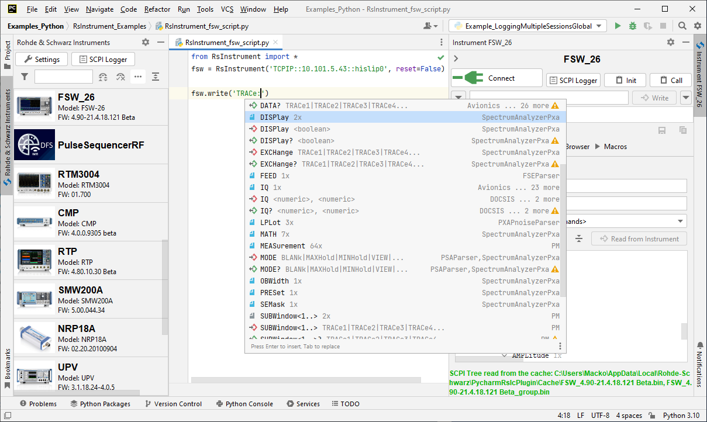

Introduction
========================================

.. image:: icon.png
   :class: with-shadow
   :align: left
   
RsInstrument is a Python remote-control communication module for Rohde & Schwarz SCPI-based Test and Measurement Instruments. After reading this guide you will be convinced of its edge over other remote-control packages.

The original title of this document was **"10 Tips and Tricks..."**, but there were just too many cool features to fit into 10 chapters. Some of the RsInstrument's key features:

- Type-safe API using typing module
- You can select which VISA to use or even not use any VISA at all
- Initialization of a new session is straight-forward, no need to set any other properties
- Many useful features are already implemented - reset, self-test, opc-synchronization, error checking, option checking
- Binary data blocks transfer in both directions
- Transfer of arrays of numbers in binary or ASCII format
- File transfers in both directions
- Events generation in case of error, sent data, received data, chunk data
- Multithreading session locking - you can use multiple threads talking to one instrument at the same time
- Logging feature tailored for SCPI communication

Check out RsInstrument script examples here: `Rohde & Schwarz GitHub Repository <https://github.com/Rohde-Schwarz/Examples/tree/main>`_.

Short Getting-started video from our Oscilloscope guys:

.. raw:: html

    

        <iframe src="https://www.youtube.com/embed/DsibuH51IVw" frameborder="0" allowfullscreen style="position: absolute; top: 0; left: 0; width: 100%; height: 100%;"></iframe>
    

Oh, one other thing - for Pycharm users we just released a Remote-control Plugin that makes your Pycharm development of remote-control script much faster:

   
.. raw:: html

	
<iframe width="245px" height="48px" frameBorder="0" src="https://plugins.jetbrains.com/embeddable/install/19828"></iframe>
